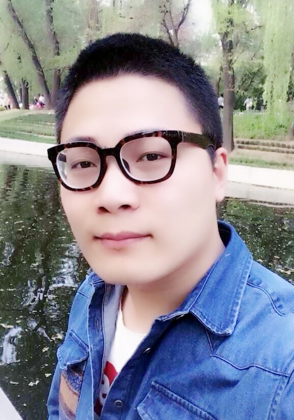

# Lijun Zhao

He is now an associate professor in the Institute of Digital Media and Communication, Taiyuan University of Science and Technology, China.

Researchgate: https://www.researchgate.net/profile/Lijun_Zhao13

Linkedin: https://www.linkedin.com/in/%E5%88%A9%E5%86%9B-%E8%B5%B5-80361bb0/

Publons: https://publons.com/researcher/3002492/lijun-zhao

Reviewer for IEEE Journals：IEEE Transactions on Visualization and Computer Graphics, IEEE Transactions on Wireless Communication, IEEE Journal of Selected Topics in Signal Processing, IEEE Transactions on Industrial Informatics, IEEE Transactions on Image Processing, IEEE Transactions on Broadcasting, IEEE Transactions on Multimedia, IEEE Transactions on Circuits and Systems for Video Technology, IEEE Transactions on Consumer Electronics.

Reviewer for Elsevier Journals：Expert Systems with Applications, Pattern Recognition, Biomedical Signal Processing and Control, Computer Vision and Image Understanding, Signal Processing: Image Communication, Journal of King Saud University - Computer and Information Sciences, Measurement, International Journal of Electrical Power and Energy Systems

Reviewer for Other Journals：Machine Learning, ISA Transactions, Jordanian Journal of Computers and Information Technology, Signal, Image and Video Processing, IET Communications, IET Image Processing, IET Generation, Transmission & Distribution.

Reviewer for International Conferences：IEEE ICASSP 2024, IEEE ICASSP 2023, IEEE ICME 2023, IEEE ICME 2022, IEEE ICME 2021, IEEE ICME 2020, VCIP 2017, VCIP 2019, ICIG 2019.

# Publication 2023

#### @article{Zhao2023EGINet,
  title={Boundary-constrained interpretable image reconstruction network for deep compressive sensing},
  author={Lijun Zhao, Xinlu Wang, Jinjing Zhang, Anhong Wang, Huihui Bai},
  journal={Knowledge-Based Systems},
  volume={275},
  pages={110681-110697},
  year={2023},
  publisher={Elsevier}
}

#### @article{Zhao2023DTSD,
  title={Learning deep texture-structure decomposition for low-light image restoration and enhancement},
  author={Lijun Zhao, Ke Wang, Jinjing Zhang, Anhong Wang, Huihui Bai},
  journal={Neurocomputing},
  volume={524},
  pages={126-141},
  year={2023},
  publisher={Elsevier}
}
      
#### @article{Zhao2023JGF,
  title={Joint depth map super-resolution method via deep hybrid-cross guidance filter},
  author={Ke Wang, Lijun Zhao, Jinjing Zhang, Jialong Zhang, Anhong Wang, Huihui Bai},
  journal={Pattern Recognition},
  volume={136},
  pages={109260-109273},
  year={2023},
  publisher={Elsevier}
}

#### @article{zhao2023Artifact-Review,
  title={A survey of research on compressed image enhancement methods},
  author={Lijun Zhao, Congying Cao, Jinjing Zhang, Jie Zhao, Bingtao Chen, Anhong Wang},
  journal={Computer Engineering and Applications},
  pages={xxxx-xxxx},
  year={2023},
  publisher={CNKI}
}

#### @article{zhao2023DSR-Review,
  title={A review of depth map super-resolution reconstruction research: The latest methods, applications, and challenges},
  author={Lijun Zhao, Ke Wang, Jinjing Zhang, Jialong Zhang, Anhong Wang},
  journal={Application Research of Computers},
  pages={1621-1629},
  year={2023},
  publisher={CNKI}
}
  
#### @article{zhao2023ICIP,
  title={A Joint Model-Driven Unfolding Network for Degraded Low-Quality Color-Depth Images Enhancement},
  author={Lijun Zhao, Ke Wang, Jinjing Zhang, Jie Zhao, Anhong Wang},
  booktitle={2023 IEEE International Conference on Image Processing (ICIP)},
  year={2023},
  organization={IEEE}
}

#### @article{zhao2023ICME,
  title={Explainable unfolding network for joint edge-preserving depth map super-resolution},
  author={Jialong Zhang, Lijun Zhao, Jinjing Zhang, Ke Wang, Anhong Wang},
  booktitle={2023 IEEE International Conference on Multimedia and Expo (ICME)},
  year={2023},
  organization={IEEE}
}

#### @article{zhao2023ICIG,
  title={Edge-guided interpretable neural network for image compressive sensing reconstruction},
  author={Xinlu Wang and Lijun Zhao and Jinjing Zhang and and Anhong Wang},
  booktitle={International Conference on Image and Graphics (ICIG)},
  year={2023},
  organization={Springer}
}

# Publication 2022

#### @article{zhao2022SDMD,
  title={Single depth map denoising method by combining high- and low-frequency decomposition and multi-scale two-level fusion strategy},
  author={Lijun Zhao, Ke Wang, Jinjing Zhang, Huihui Bai, Yao Zhao},
  booktitle={JOURNAL OF BEIJING JIAOTONG UNIVERSITY},
  year={2022},
  organization={CNKI}
}

#### @article{Zhao2022FLFuse,
  title={FLFuse-Net: A fast and lightweight infrared and visible image fusion network via feature flow and edge compensation for salient information},
  author={Weimin Xue, Anhong Wang, Lijun Zhao},
  journal={Infrared Physics and Technology},
  volume={127},
  pages={104383},
  year={2022},
  publisher={Elsevier}
}

#### @article{zhao2022D2-UTransformer,
  title={D2-UTransformer: Deep modulated dual-UTransformer for multiple description image enhancement},
  author={Congying Cao, Lijun Zhao, Jinjing Zhang, Xinlu Wang, Anhong Wang},
  booktitle={IEEE 5th International Conference on Multimedia Information Processing and Retrieval},
  year={2022},
  organization={IEEE}
}

#### @article{zhao2022MDC-IE,
  title={Multiple description coded image enhancement method with joint learning of side- and central-decoding features},
  author={Lijun Zhao, Congying Cao, Jinjing Zhang, Huihui Bai, Yao Zhao, Anhong Wang},
  journal={Application Research of Computers},
  pages={2873-2880},
  year={2022},
  publisher={CNKI}
}

#### @article{zhao2022LMDC,
  title={LMDC: Learning a multiple description codec for deep learning-based image compression},
  author={Lijun Zhao, Jinjing Zhang, Huihui Bai, Anhong Wang, Yao Zhao},
  journal={Multimedia Tools and Applications},
  volume={81},
  pages={13889–13910,
  year={2022},
  publisher={Springer}
}

#### @inproceedings{zhang2022sf,
  title={SF-SegFormer: Stepped-fusion segmentation transformer for brain tissue image via inter-group correlation and enhanced multi-layer perceptron},
  author={Jinjing Zhang, Lijun Zhao, Jianchao Zeng, Pinle Qin},
  booktitle={Annual Conference on Medical Image Understanding and Analysis},
  pages={508--518},
  year={2022},
  organization={Springer}
}

#### @article{jing2022ESWA,
  title={Deep MRI glioma segmentation via multiple guidances and hybrid enhanced-gradient cross-entropy loss},
  author={Jinjing Zhang, Lijun Zhao, Jianchao Zeng, Pinle Qin, Yanbo Wang, Xiaoqing Yu},
  journal={Expert Systems With Applications},
  volume={196},
  pages={116608},
  year={2022},
  publisher={Elsevier}
}

# Publication 2021

#### @inproceedings{zhao2021DepthSR,
  title={From deep image decomposition to single depth image super-resolution},
  author={Lijun Zhao, Ke Wang, Jinjing Zhang, Huihui Bai, Yao Zhao},
  booktitle={Image and Graphics Technologies and Applications},
  year={2021},
  organization={Springer}
}

#### @article{ning2021mranet,
  title={MRANet: Multi-atrous residual attention Network for stereo image super-resolution},
  author={Luyao Ning, Anhong Wang, Lijun Zhao, Weimin Xue, Donghan Bu},
  journal={Journal of Visual Communication and Image Representation},
  volume={77},
  pages={103115},
  year={2021},
  publisher={Elsevier}
}

# Publication 2020

#### @article{zhao2020Concurrent[[PDF]](https://arxiv.org/abs/2001.03847)[[Project]](https://github.com/mdcnn/CEIN),
  title={Concurrently extrapolating and interpolating networks for continuous model generation},
  author={Lijun Zhao, Jinjing Zhang, Fan Zhang, Anhong Wang, Huihui Bai, Yao Zhao},
  journal={arXiv preprint arXiv:2001.03847},
  year={2020}
}

#### @article{zhang2020brain[[PDF]](https://www.sciencedirect.com/science/article/abs/pii/S0925231220314211),
  title={Brain tumor segmentation of multi-modality MR images via triple intersecting U-Nets},
  author={Jinjing Zhang, JianchaoZeng, Pinle Qin, Lijun Zhao},
  journal={Neurocomputing},
  year={2020}
}

# Publication 2019

#### @article{zhao2019multiple[[PDF]](https://ieeexplore.ieee.org/document/8445655)[[Project]](https://github.com/mdcnn/MDCNN_test40),
  title={Multiple description convolutional neural networks for image compression},
  author={Lijun Zhao, Huihui Bai, Anhong Wang, Yao Zhao},
  journal={IEEE Transactions on Circuits and Systems for Video Technology},
  year={2019}
}

#### @article{zhao2019simultaneous[[PDF]](https://www.sciencedirect.com/science/article/pii/S0031320318304175)[[Project]](https://github.com/mdcnn/CDcGAN),
  title={Simultaneous color-depth super-resolution with conditional generative adversarial networks},
  author={Lijun Zhao, Huihui Bai, Jie Liang, Bing Zeng, Anhong Wang, Yao Zhao},
  journal={Pattern Recognition},
  volume={88},
  pages={356–369},
  year={2019}
  publisher={Elsevier}
}

#### @article{zhao2019LAD[[PDF]](https://www.sciencedirect.com/science/article/pii/S0165168418303724)[[Project]](https://github.com/mdcnn/Local-Activity-Driven-Filtering),
  title={Local activity-driven structural-preserving filtering for noise removal and image smoothing},
  author={Lijun Zhao, Huihui Bai, Jie Liang, Anhong Wang, Bing Zeng, Yao Zhao},
  journal={Signal Processing},
  volume={157},
  pages={62–72},
  year={2019}
  publisher={Elsevier}
}

#### @article{zhao2019codec[[PDF]](https://www.sciencedirect.com/science/article/pii/S104732031930210X)[[Project]](https://github.com/mdcnn/Virtual_Codec_Network),
  title={Learning a virtual codec based on deep convolutional neural network to compress image},
  author={Lijun Zhao, Huihui Bai, Anhong Wang, Yao Zhao},
  journal={Journal of Visual Communication and Image Representation},
  publisher={Elsevier}
}

#### @inproceedings{zhao2019dmdc[[PDF]](https://arxiv.org/abs/1811.01504v3)[[Project]](https://github.com/mdcnn/Deep-Multiple-Description-Coding),
  title={Deep multiple description coding by learning scalar quantization}, 
  author={Lijun Zhao, Huihui Bai, Anhong Wang, Yao Zhao}, 
  booktitle={Data Compression Conference}, 
  year={2019}, 
  organization={IEEE} }
  
# Publication 2018

#### @article{zhao2018virtual[[PDF]](http://arxiv.org/abs/1806.08514),
  title={Virtual codec supervised re-sampling network for image compression},
  author={Zhao, Lijun and Bai, Huihui and Wang, Anhong and Zhao, Yao},
  journal={arXiv preprint arXiv:1806.08514},
  year={2018}
}

#### @article{wang2018cascaded[[PDF]](http://link.springer.com/article/10.1186/s13640-018-0315-5),
  title={Cascaded reconstruction network for compressive image sensing},
  author={Wang, Yahan and Bai, Huihui and Zhao, Lijun and Zhao, Yao},
  journal={EURASIP Journal on Image and Video Processing},
  year={2018}
}

# Publication 2017

#### @article{zhao2017two[[PDF]](https://www.sciencedirect.com/science/article/pii/S0923596517300255)[[Project]](https://github.com/mdcnn/Depth-Image-Quality-Enhancement),
  title={Two-stage filtering of compressed depth images with Markov Random Field},
  author={Zhao, Lijun and Bai, Huihui and Wang, Anhong and Zhao, Yao and Zeng, Bing},
  journal={Signal Processing: Image Communication},
  volume={54},
  pages={11--22},
  year={2017},
  publisher={Elsevier}
}

#### @article{zhao2017iterative[[PDF]](https://link.springer.com/article/10.1007/s11042-017-5253-1)[[Project]](https://github.com/mdcnn/Depth-Image-Quality-Enhancement),
  title={Iterative range-domain weighted filter for structural preserving image smoothing and de-noising},
  author={Zhao, Lijun and Bai, Huihui and Wang, Anhong and Zhao, Yao},
  journal={Multimedia Tools and Applications},
  pages={1--28},
  year={2017},
  publisher={Springer}
}

#### @inproceedings{zhao2017single[[PDF]](https://ieeexplore.ieee.org/abstract/document/8019331/),
  title={Single depth image super-resolution with multiple residual dictionary learning and refinement},
  author={Zhao, Lijun and Bai, Huihui and Liang, Jie and Wang, Anhong and Zhao, Yao},
  booktitle={Multimedia and Expo (ICME), 2017 IEEE International Conference on},
  pages={739-744},
  year={2017},
  organization={IEEE}
}

#### @inproceedings{zhao2017single[[PDF]](https://ieeexplore.ieee.org/abstract/document/8296720/),
  title={Convolutional Neural Network-based Depth Image Artifact Removal},
  author={Zhao, Lijun and Bai, Huihui and Liang, Jie and Wang, Anhong and Zhao, Yao},
  booktitle={Image Processing (ICIP), 2017 IEEE International Conference on},
  pages={739-744},
  year={2017},
  organization={IEEE}
}

# Publication 2016

#### @inproceedings{zhao2016joint[[PDF]](http://ieeexplore.ieee.org/document/7805457/),
  title={Joint iterative guidance filtering for compressed depth images},
  author={Zhao, Lijun and Bai, Huihui and Wang, Anhong and Zhao, Yao},
  booktitle={Visual Communications and Image Processing (VCIP), 2016},
  pages={1-4},
  year={2016},
  organization={IEEE}
}

# Publication 2015

#### @article{zhao2015candidate[[PDF]](https://www.researchgate.net/publication/273395477_Candidate_value-based_boundary_filtering_for_compressed_depth_images)[[Project]](https://github.com/mdcnn/Depth-Image-Quality-Enhancement),
  title={Candidate value-based boundary filtering for compressed depth images},
  author={Zhao, Lijun and Wang, Anhong and Zeng, Bing and Wu, Yingchun},
  journal={Electronics Letters},
  volume={51},
  number={3},
  pages={224--226},
  year={2015},
  publisher={IET}
}

#### @article{zhao2015scalable[[PDF]](http://www.kpubs.org/article/articleDownload.kpubs?downType=pdf&articleANo=E1KOBZ_2015_v9n10_4108),
  title={Scalable coding of depth images with synthesis-guided edge detection},
  author={Zhao, Lijun and Wang, Anhong and Zeng, Bing and Jin, Jian},
  journal={KSII Transactions on Internet and Information Systems},
  volume={9},
  number={10},
  year={2015}
}
